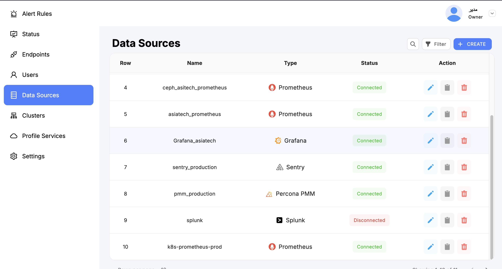

# SkyLogs Datasources

SkyLogs integrates with a wide range of monitoring, logging, and observability platforms.  
A **datasource** is an external system that SkyLogs can pull alerts, metrics, logs, or events from.  
Datasources allow SkyLogs to centralize alert management, correlate incidents, and build a unified observability view.

This document describes:

- What datasources are
- Supported datasource types
- Common configuration fields
- Type-specific examples
- Validation rules
- How SkyLogs uses datasources
- Troubleshooting tips
- datasource healthcheack 

---

## What Is a Datasource?

A datasource in SkyLogs represents an external system such as Prometheus, Grafana, Elasticsearch, or Zabbix.  
SkyLogs connects to these systems via their API endpoints to:

- Fetch alerts  
- Query metrics or logs  
- Enrich incidents with additional metadata  
- Build status pages  
- Correlate alerts across multiple systems  

Once added, a datasource can be shared across multiple teams, services, and environments.

---

## Supported Datasource Types

SkyLogs currently supports the following datasources:

| Type             | Description |
|------------------|-------------|
| **Prometheus**   | Native Prometheus API integration using `/api/v1`. |
| **VictoriaMetrics** | Compatible with Prometheus endpoints. Works for VM single-node and cluster setups. |
| **Grafana**      | Fetches alerts using Grafana Unified Alerting API. |
| **Zabbix**       | Connects to Zabbix API to read hosts, triggers, and events. |
| **Splunk**       | Queries Splunk via REST API or saved searches. |
| **Elasticsearch** | Fetches data using Elasticsearch Query DSL. |
| **PMM (Percona Monitoring & Management)** | Uses PMM API for MySQL/MongoDB metric and alert integration. |

---

## Common Fields

All datasources share a core set of configuration options:

```yaml
name: string          # Human-friendly name of the datasource
type: string          # One of: prometheus, victoria, grafana, zabbix, splunk, elasticsearch, pmm
url: string           # Base URL of the datasource API
enabled: bool         # If false, datasource will not be queried
timeout: int          # HTTP request timeout in seconds
auth:
  type: string        # none | basic | token | bearer | api_key
  username: string    # Optional (basic auth)
  password: string    # Optional (basic auth)
  token: string       # Optional (token, bearer, api_key)
options:              # Optional type-specific fields
  key: value
```

---

## datasource health check
Datasources is the source of all alerts so if skylogs fail to fethch alerts we are blinded to a part of important of system so it is crutial to maintain connectivity to datasources and got alerts. 


