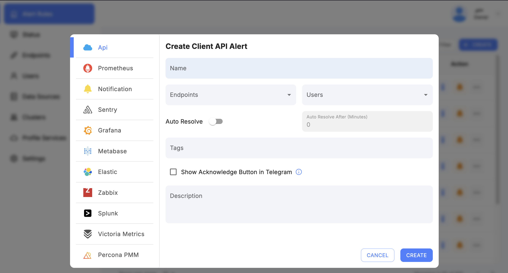
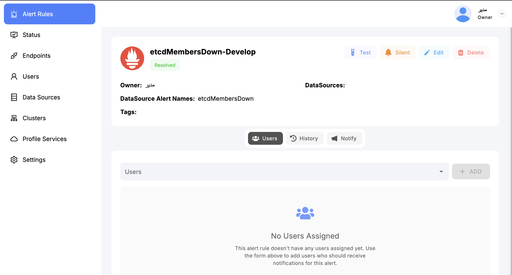
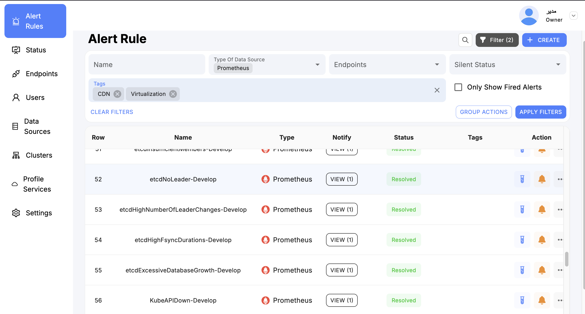
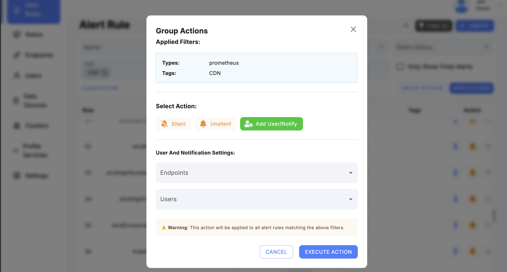

# Alert Management in SkyLogs

SkyLogs provides a flexible and powerful alert management system designed to work seamlessly with multiple datasources such as Prometheus, VictoriaMetrics, Elasticsearch, and others.  
This document explains how to create alerts, manage them, filter large volumes, and use advanced tools like grouping and pinning.

---

## Creating a New Alert

To create a new alert in SkyLogs:

1. **Select the Alert Type**  
   Choose the monitoring system you want to create an alert for (e.g., *Prometheus*).  
   Each alert type corresponds to a specific datasource.

2. **Choose a Datasource**  
   After selecting the alert type, choose the corresponding datasource (e.g., your Prometheus server).

3. **Enter a Unique Alert Name**  
   The alert name must be unique to ensure clear identification across the platform.

4. **Assign One or More Endpoints**  
   Select the endpoints that should receive and process the alert.

5. **(Optional) Assign a Tag**  
   Tags help with:
   - Grouping alerts  
   - Filtering  
   - Status pages  
   - Bulk operations  
   - Organizing and managing alerts  

Once submitted, the alert will appear in the alert list with all its configuration.

---

## Alert View Page

Clicking on an alert opens the **Alert View Page**, which provides comprehensive tools and controls for managing that alert.

You can:

- View alert **configuration**, **status**, and **history**
- Assign or change **users** and **groups**
- Modify or add **endpoints**
- Make the alert **silent** (temporarily disable notifications)
- Edit or update the alert configuration
- Review all triggered events for that alert
- Add or modify tags
- Manage access controls and permissions

The Alert View Page is designed to give you full control and visibility over the alert.

---

## Filtering and Group Actions

In large environments, SkyLogs may contain **thousands of alerts** from multiple datasources and systems.  
To manage them efficiently, SkyLogs provides powerful filtering and bulk-action (group action) tools.

### Filtering

You can filter alerts based on:

- Alert type  
- Datasource  
- Assigned user  
- Endpoint  
- Status (active, silenced, disabled, etc.)  
- Tags  

Filtering helps you quickly locate specific alerts or narrow down large numbers for further processing.

### Group (Bulk) Actions

After filtering, you can apply bulk actions to multiple alerts at once:

- Change endpoint  
- Add new endpoints  
- Assign or change user  
- Apply tags  
- Make alerts silent  
- Enable or disable alerts  

These tools significantly streamline mass alert management, especially in large-scale deployments.

---

## Pinning Alerts

Inside the **Alert Rule Page**, SkyLogs provides a **Pin** feature.

### Why Pin Alerts?

Pinning allows you to mark important or critical alerts so they always appear at the top of the page.

This is useful for:

- Critical production alerts  
- Alerts under investigation  
- Alerts requiring daily monitoring  
- High-business-impact warnings  

Pinned alerts remain visible regardless of sorting or filtering, ensuring teams stay constantly aware of high-priority conditions.

---

## Summary

SkyLogs offers a comprehensive and user-friendly system for creating, managing, and organizing alerts.  
With features like detailed configuration views, filtering, group actions, and alert pinning, teams can efficiently manage even the largest alert volumes across multiple datasources.

